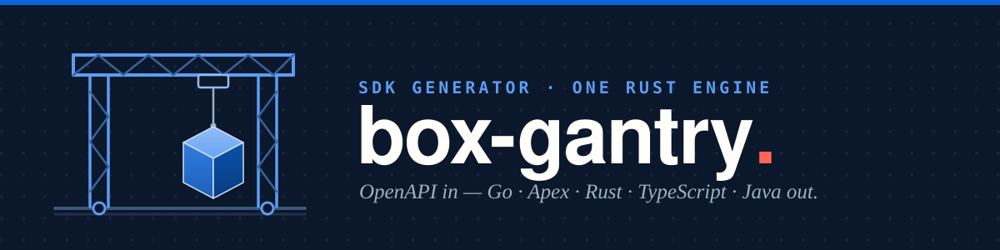

# box-gantry

[](https://github.com/unofficialbox/box-gantry/actions/workflows/ci.yml)
[](./LICENSE)


A net-new SDK generator, written in Rust, that consumes the Box OpenAPI
specification and generates Box SDKs — **Go** (v1), **Salesforce Apex**
(v2), **Rust** (v3), **TypeScript** (v4), and **Java 26** (v5). No dependencies
on existing SDKs or existing developers; box-codegen is consultable prior art
only.

> **Not affiliated with, authorized, or endorsed by Box, Inc.** "Box" is a
> trademark of Box, Inc. This is an independent generator that produces
> community-built clients from the public OpenAPI specification.

## Quickstart

Rust only (the toolchain is pinned by `rust-toolchain.toml`):

```sh
cargo test --workspace          # engine tests, incl. ingesting the real Box specs
cargo run -p gantry-cli -- check \
  fixtures/specs/openapi.json \
  fixtures/specs/openapi-v2025.0.json \
  fixtures/specs/openapi-v2026.0.json
```

The `gantry` CLI has five subcommands: `check` (ingest + validate a spec
set), `generate` (emit an SDK), `verify` (generate then compile with the
target toolchain), `conform` (the R§1 capability checklist), and `diff` (the
breaking-change report between two spec sets). The **Go SDK (v1) is shipped**,
and Apex (v2), Rust (v3), TypeScript (v4), and Java (v5) are feature-complete —
each with a `verify` toolchain gate (formatter + compiler + tests) and a
`conform` capability checklist gating the CI release check.

## Generating SDKs

`generate` emits **one** target per run — `--target` takes a single manifest
key and `--out` the output directory. All five targets are selectable —
`go`, `apex`, `rust`, `typescript`, and `java`. The trailing arguments are the
spec set: the base spec plus each versioned overlay, ingested together.

```sh
# One SDK — Apex into ./out/apex
cargo run -p gantry-cli -- generate --target apex --out out/apex \
  fixtures/specs/openapi.json \
  fixtures/specs/openapi-v2025.0.json \
  fixtures/specs/openapi-v2026.0.json

# Another target — Go into ./out/go (same spec set)
cargo run -p gantry-cli -- generate --target go --out out/go \
  fixtures/specs/openapi.json \
  fixtures/specs/openapi-v2025.0.json \
  fixtures/specs/openapi-v2026.0.json
```

Build **several targets at once** by passing a comma-separated list (or
repeating `--target`); use `all` for the whole fleet. With more than one target
each SDK lands in its own `<out>/<target>/` subdirectory (`out/go`, `out/apex`):

```sh
# A subset — Go and Apex into out/go and out/apex
cargo run -p gantry-cli -- generate --target go,apex --out out \
  fixtures/specs/openapi.json \
  fixtures/specs/openapi-v2025.0.json \
  fixtures/specs/openapi-v2026.0.json

# Everything
cargo run -p gantry-cli -- generate --target all --out out \
  fixtures/specs/openapi.json \
  fixtures/specs/openapi-v2025.0.json \
  fixtures/specs/openapi-v2026.0.json
```

To generate **and compile** the output with the target's real toolchain, use
`verify` instead (Go today; Apex compiles on the Salesforce platform via the
`apex-scratch` workflow, VR-1.3):

```sh
cargo run -p gantry-cli -- verify --target go \
  fixtures/specs/openapi.json \
  fixtures/specs/openapi-v2025.0.json \
  fixtures/specs/openapi-v2026.0.json
```

## Generated SDKs

Each target is released to its own repo, regenerated from this engine by
`release.yml` (`scripts/release.sh`):

| Target | Repo |
| --- | --- |
| Go (v1) | [`unofficialbox/box-open-go-sdk`](https://github.com/unofficialbox/box-open-go-sdk) |
| Salesforce Apex (v2) | [`unofficialbox/box-open-apex-sdk`](https://github.com/unofficialbox/box-open-apex-sdk) |
| Rust (v3) | [`unofficialbox/box-open-rust-sdk`](https://github.com/unofficialbox/box-open-rust-sdk) |
| TypeScript (v4) | [`unofficialbox/box-open-ts-sdk`](https://github.com/unofficialbox/box-open-ts-sdk) |
| Java 26 (v5) | [`unofficialbox/box-open-java-sdk`](https://github.com/unofficialbox/box-open-java-sdk) |

## How it works

box-gantry is a small Rust pipeline. One spec set flows through fixed stages,
each handing the next a *more verified* value — a backend never sees anything
but a checked program:

1. **Ingest** (`gantry-spec`) — parse the OpenAPI documents, apply the naming
   rules and Box-specific quirks, and lower to a typed intermediate
   representation (`gantry-ir`).
2. **Analyze** (`gantry-sema`) — one pass binds every reference, checks the
   types are well-formed, and indexes operations by API area.
3. **Synthesize** (`gantry-synth`) — detect language-agnostic features
   (pagination, chunked upload) once, structurally, so every backend reuses a
   single definition.
4. **Lower + print** (`gantry-backend-<lang>`) — turn the analyzed program into
   a complete SDK tree, guided by a per-language **capability manifest**
   (`gantry-manifest`) and a machine-checked **runtime contract**
   (`gantry-contract`) — never by branching on the language name.
5. **Verify** (`gantry-verify`, driven by `gantry-cli`) — compile the output
   with the target's real toolchain, run a capability checklist, and diff two
   spec sets to recommend the version bump.

Each SDK ships with a small hand-written runtime (`runtimes/<lang>/`) that the
generated code compiles against. Two rules hold everywhere: **no semantics in
strings** — optionality, references, and operation kinds are structured data,
never parsed out of a name — and **loud, never silent** — an unclassifiable
shape is an error that names the file and JSON path, not a silent fallback.

## Contributing

See [`CONTRIBUTING.md`](./CONTRIBUTING.md) for the development setup, the gate
suite to run before a PR, and the pull-request workflow. box-gantry is MIT
licensed ([`LICENSE`](./LICENSE)).
